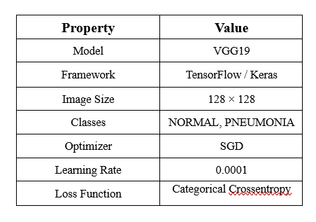
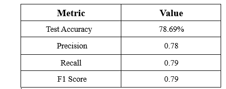
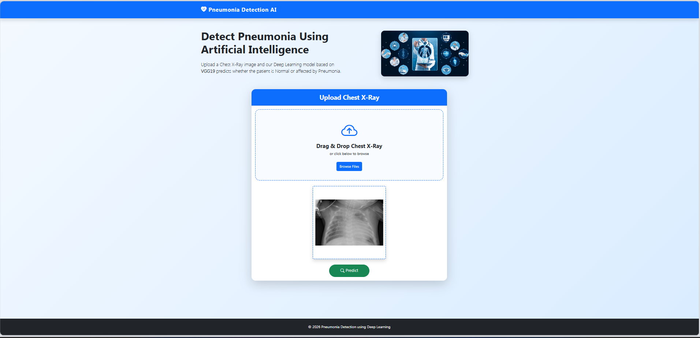

# Pneumonia Detection Using Deep Learning

A Deep Learning based web application that detects **Pneumonia** from Chest X-Ray images using the **VGG19 Transfer Learning** model. The application allows users to upload an X-Ray image, predicts whether the patient has pneumonia, displays the confidence score, and generates a professional medical report in PDF format.

-----------------------

## Project Overview

Pneumonia is a serious lung infection that requires early diagnosis for effective treatment. This project uses a Convolutional Neural Network (CNN) based on the pretrained **VGG19** architecture to classify chest X-Ray images into:

-NORMAL
-PNEUMONIA

The trained model is integrated with a Flask web application that provides an intuitive user interface for prediction and report generation.

-----------------------


## IMPORTANT NOTE

The trained model (`pneumonia_model.keras`) and the Chest X-Ray dataset are not included in this repository because of their large file size.

After cloning the repository, you must:

1. Download the Chest X-Ray dataset.
        link: https://www.kaggle.com/code/paultimothymooney/detecting-pneumonia-in-x-ray-images/input?select=chest_xray
2. Place the dataset in the following directory:

dataset/chest_xray/
        train/
        val/
        test/

3. Train the model using:

python training/train.py

After training completes, the generated model will be saved automatically inside:

flask_application/model/pneumonia_model.keras

You can then start the Flask application normally.


-----------------------
# Features

### Deep Learning
- VGG19 Transfer Learning
- TensorFlow / Keras
- Image Augmentation
- Model Evaluation
- Prediction Confidence

### Flask Web Application
- Upload Chest X-Ray Images
- Drag & Drop Image Upload
- Image Preview
- AI Prediction
- Confidence Percentage
- Responsive UI
- Loading Animation
- Prediction Dashboard

### Medical Report
- Patient Name
- Age
- Gender
- Uploaded Chest X-Ray
- Diagnosis Result
- Prediction Confidence
- Downloadable PDF Report

-----------------------

# Tech Stack

## Frontend
- HTML5
- CSS3
- Bootstrap 5
- JavaScript

## Backend
- Python
- Flask

## Deep Learning
- TensorFlow
- Keras
- VGG19
- NumPy
- OpenCV
- Pillow

## Report Generation
- ReportLab

-----------------------

# Model Information



-----------------------

# Model Performance



-----------------------

# Installation and project run guide

## Clone Repository

```bash
git clone https://github.com/shiva-9505/Pneumonia_detection.git
```

```
cd Pneumonia-Detection
```

---

## Install Dependencies

```bash
pip install -r requirements.txt
```

---

## Train the Model

```bash
python training/train.py
```

---

## Evaluate Model

```bash
python training/evaluate.py
```

---

## Run Flask Application

```bash
cd flask_application
python app.py
```

---

## Open Browser

```
http://127.0.0.1:5000
```

-----------------------

# Application Workflow

1. Upload Chest X-Ray Image

2. Enter Patient Details

- Name
- Age
- Gender

3. Click **Predict**

4. AI analyses the image

5. Prediction is displayed

- Diagnosis
- Confidence Score

6. Download Medical Report as PDF

-----------------------

# Screenshots

## Home Page


-----------------------

## Upload Image

-----------------------

## Loading Screen

-----------------------

## Prediction Result

-----------------------

## PDF Report
sample PDF link: https://drive.google.com/file/d/1F6ICfRHtbOcFX2YL-eoJPfZWX8VFCJxt/view?usp=drive_link
-----------------------

# Future Enhancements

- User Authentication
- Patient History
- Doctor Dashboard
- Grad-CAM Heatmap
- Multi Disease Detection
- Cloud Deployment
- Email Report
- Database Integration

-----------------------

# Author

**Shivakumar**

Java Backend Developer | MERN full-stack Developer| Python | Flask | TensorFlow | Deep Learning

-----------------------

# License

This project is developed for educational and practice purposes.

-----------------------

## If you found this project helpful, consider giving it a star on GitHub.